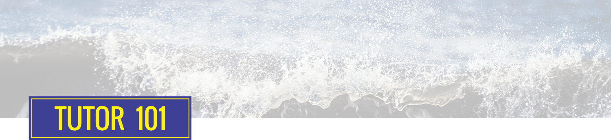

### Tutorial 101: Basic HTML CSS with Express JS & EJS

Hi! welcome to Tutorial 101..
in this tutorial we will learn about how to build html & css basic with ExpressJS as main engine and EJS for the template engine. So let's get started!

#### 1. Installation

As we use ExpressJS as the main engine, we need to know that we will use [NodeJS](https://nodejs.org/en/ "NodeJS") and [npm](https://www.npmjs.com/ "npm")

```
npm init
npm install -S express body-parser
npm install -S ejs express-ejs-layouts
```

**Note** if you want to use Git, don't forget to add **.gitignore**

```
touch .gitignore
```

#### 2. Build skeleton

```
├── public
│   └── css
│       └── style.css
├── routes
│   └── index.js
├── views
│   ├── pages
│   │   └── home.ejs
│   ├── layout.ejs
│   ├── layout-head.ejs
│   └── layout-footer.ejs
├── .gitignore
└── index.js
```

#### 3. Init index.js

Init required modules

```
const express = require('express'),
      bodyParser = require('body-parser'),
      path = require('path'),
      ejs = require('ejs'),
      expressLayouts = require('express-ejs-layouts')
```

Setup index.js

```
var app = express()
var port = process.env.PORT || 9000

// Set template engine
app.set('view engine', 'ejs')
app.use(expressLayouts)

// Set starting routes
app.use(express.static(path.join(__dirname, 'public')))
app.use('/', require('./routes'))

// Set port
app.listen(port)
console.log(`Live on port ${port}`)
```

#### 4. Init routes (routes/index.js)

```
var express = require('express')
var router = express.Router()

router.get('/', function(req, res, next) {
  res.render('pages/home')
})

module.exports = router
```

#### 5. Init views

We can use [Bootstrap](http://getbootstrap.com/ "Bootstrap") as css framework, and [jQuery](https://jquery.com/ "jQuery") as javascript library

Main layout (views/layout.ejs)

```
<!DOCTYPE html>
<html lang="en">
<head>
  <%- include layout-header.ejs %>
</head>
<body>
  <%- content %>
  <%- include layout-footer.ejs %>
</body>
</html>
```

Main layout header (views/layout-header.ejs)

```
<meta charset="UTF-8">
<meta name="viewport" content="width=device-width, initial-scale=1.0">
<meta http-equiv="X-UA-Compatible" content="ie=edge">
<title>Tutorial 101: Basic HTML CSS with Express JS & EJS</title>
<link rel="shortcut icon" href="/image/favicon.png" />
<link rel="stylesheet" href="https://maxcdn.bootstrapcdn.com/bootstrap/3.3.7/css/bootstrap.min.css" integrity="sha384-BVYiiSIFeK1dGmJRAkycuHAHRg32OmUcww7on3RYdg4Va+PmSTsz/K68vbdEjh4u" crossorigin="anonymous">
<link rel="stylesheet" href="/css/style.css">
```

Main layout footer (views/layout-footer.ejs)

```
<script src="http://code.jquery.com/jquery-3.1.1.min.js"></script>
<script src="https://maxcdn.bootstrapcdn.com/bootstrap/3.3.7/js/bootstrap.min.js" integrity="sha384-Tc5IQib027qvyjSMfHjOMaLkfuWVxZxUPnCJA7l2mCWNIpG9mGCD8wGNIcPD7Txa" crossorigin="anonymous"></script>
<script src="/js/core.js"></script>
```

Page home (views/pages/home.ejs)

```
<%- contentFor('content') %>

<h1>Home Page</h1>
```

#### 6. Init css (public/css/style.css)

```
html{
  background: #add8e6; // light blue
}
```

#### 7. Start the engine!

```
node index.js
```
